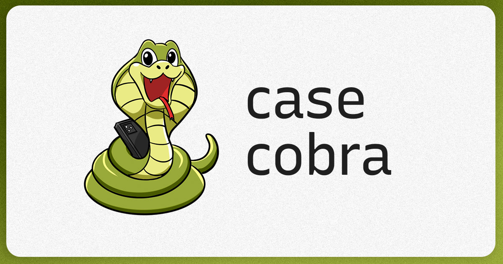

# CaseCobra - A Modern Fullstack E-Commerce Shop for Custom Phone Cases

Built with the Next.js 14 App Router, Postgres, TypeScript, Tailwind & Kinde Auth

## Badges

#  Table of Contents

- Features
- Instalation
- Getting Started
- FAQ
- Found a bug ? Missing a specific feature ?
- Contributing
- License

##  Features

- 🛠️ Complete shop built from scratch in Next.js 14
- 💻 Beautiful landing page included
- 🎨 Custom artworks made by a professional illustrator
- 💳 Secret admin dashboard to manage orders
- 🖥️ Drag-and-drop file uploads
- 🛍️ Customers can purchase directly from you
- 🌟 Clean, modern UI on top of shadcn-ui
- 🛒 Completely custom phone case configurator
- 🔑 Authentication using Kinde
- ✉️ Beautiful thank-you email after purchase
- ✅ Apple-inspired configuration design
- ⌨️ 100% written in TypeScript
- 🎁 ...much more

##  Instalation

**You need to install [Node.js](https://nodejs.org/en/download/) and [Yarn](https://yarnpkg.com/) first, then in order to clone the project via HTTPS, run this command:**

_git clone https://github.com/Shyroe/repo.git_

SSH URLs provide access to a Git repository via SSH, a secure protocol. If you have a SSH key registered in your Github account, clone the project using this command:

_git clone https://github.com/Shyroe/casecobra_shop.git_

and copy the .env.example variables into a separate .env file, fill them out & and that's all you need to get started!

**Install dependencies**

_pnpm install_

##  Getting Started

Run the following command in order to start the application in a development environment:

_npm run dev_

**NextJS: open the source code and start editing!**

    Your site is now running at `http://localhost:3000`!

    At Localhost Environment: Install Stripe CLI and run webhook command: stripe --forward-to http://localhost:3000/api/webhooks
    
    
##  FAQ

**Question**: What are the tecnologies used in this project?

**Answer**: nextjs, stripe for payment, kinde for Authentication, Prisma ORM, zod, react-email and resend for Template Email Messages, uploadthing for Upload images, shadcn/ui and radix for UI.

##  Issues

Feel free to file a new issue with a respective title and description on the the Amazon Next repository. If you already found a solution to your problem, i would love to review your pull request! Have a look at our contribution guidelines to find out about the coding standards.

##  Contributing

Check out the contributing page to see the best places to file issues, start discussions and begin contributing.

##  License

